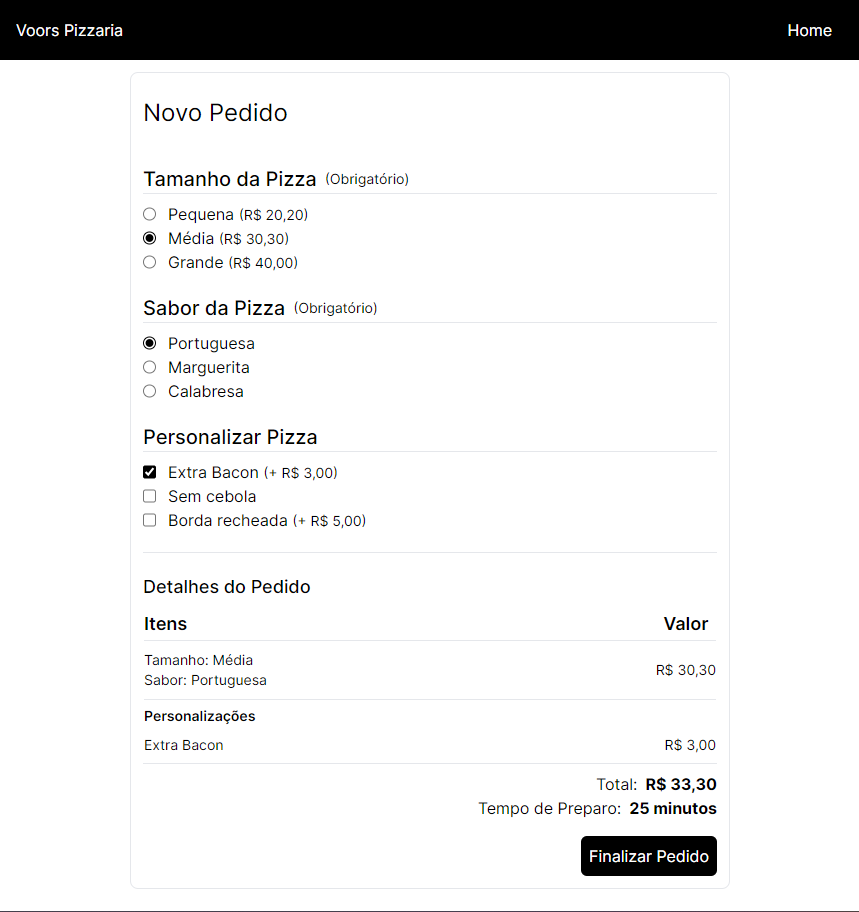
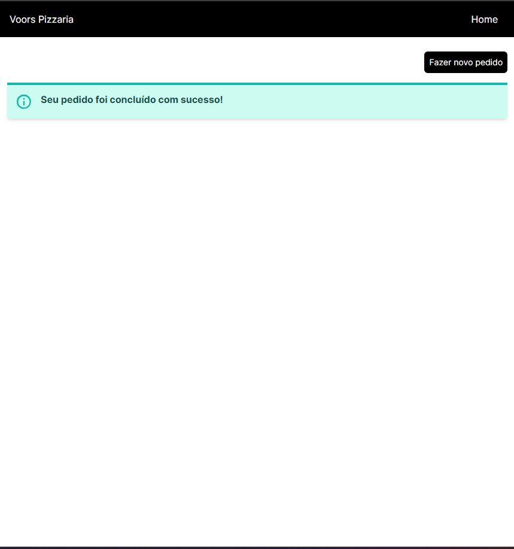

## Problema:
  Este projeto foi a resolução do problema proposto que pode ser consultado aqui: [Problema](PROBLEM.md)

## Resolução:
  Foi criado uma página simples com o formulário do pedido de acordo com a proposta e um Servidor fake (JSON Server) para que o Front-End consiga se comunicar.


## Telas

1. Formulário
   <br /> <br />
     

2. Pedido realizado com sucesso  
   <br/> 
   

## Ferramentas Utilizadas
 - React
 - Vite
 - TypeScript 
 - Tailwind CSS
 - React Router DOM
 - JSON Server
 - Docker
  
## Testar localmente
### Para criação da imagem e do container, digite os seguintes comandos na base desse projeto:
  1. Clonar este repositório: <br />
     ```bash
        git clone https://github.com/caiolucasw/teste-tecnico.git
      ```
  2. Rodar estes comandos na root do projeto: <br />
     ```bash
      docker build -t teste-tecnico .
     ```
     
     ```bash
      docker run -d -p 5173:5173 -p 3000:3000 teste-tecnico
     ```

## Autor
 ### Caio Lucas Silveira de Sousa <br><br> [](https://linkedin.com/in/caiolsds)

